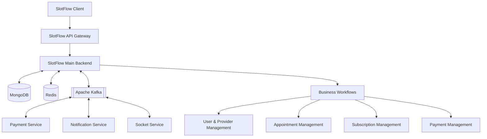
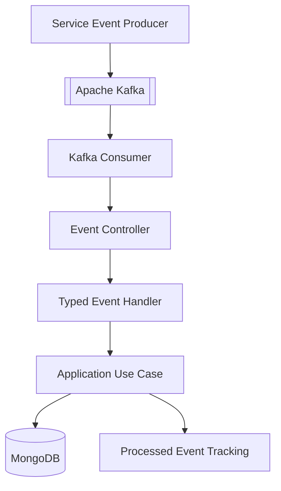

 <div align="center">

# SlotFlow Main Backend

### The core engine behind SlotFlow.

The central backend microservice powering SlotFlow's appointment booking workflows, provider management, subscriptions, payments, account operations, and event-driven business logic.


---

### Live Link & Repositories

<a href="https://slotflow.online">
  
</a>
<a href="https://github.com/slotflow">
  
</a>

### Technology Stack


</div>

---

## Overview

The **SlotFlow Main Backend** is the central business logic service within the SlotFlow appointment booking platform. It manages the core application workflows that connect customers, service providers.

Built with Node.js, TypeScript, Express, and MongoDB, the service organizes business operations into modular application layers and integrates with supporting services through HTTP communication and asynchronous messaging.

Apache Kafka enables event-driven workflows across the SlotFlow ecosystem, while MongoDB provides persistent storage for application data and business records.

The service works alongside the SlotFlow API Gateway, Socket Service, Payment Service, Notification Service, and infrastructure components to support the platform's end-to-end appointment lifecycle.

---

## Core Features

### User & Account Management

- Customer and service provider account management
- Registration and email verification workflows
- Google authentication integration
- Role-based access control
- User profile management
- Provider onboarding and verification workflows
- Account status and lifecycle management

### Provider Management

- Provider profile and service information management
- Service category and specialization management
- Provider experience, pricing, and portfolio details
- Service delivery mode configuration
- Availability and working schedule management
- Provider verification and onboarding
- Provider discovery and filtering

### Appointment Management

- Appointment booking and lifecycle management
- Customer and provider appointment coordination
- Provider availability and time-slot management
- Appointment status transitions
- Booking-related validation and business rules
- Cancellation workflows
- Appointment history management

### Payment Management

- Appointment payment workflows
- Payment status tracking
- Payment record management
- Payment-related business validation
- Integration with the SlotFlow Payment Service
- Refund-related appointment workflows
- Payment event processing

### Subscription Management

- Provider subscription plans
- Subscription lifecycle management
- Subscription status tracking
- Trial and paid subscription workflows
- Subscription payment event processing
- Provider feature access based on subscription status
- Subscription-related account updates

### Event-Driven Processing

- Apache Kafka integration
- Kafka event consumption and processing
- Typed event payloads
- Event-specific business handlers
- Processed-event tracking
- Retry and failure-handling workflows
- Integration with payment, notification, and socket services

### Supporting Business Workflows

- Referral-related operations
- Customer credit management
- Booking and payment history
- Account-related business operations
- Policy and application data management
- Coordination between core business modules

---

## Technology Stack

### Runtime & Backend

<p align="left">
  
  
  
  
</p>

### Database & Messaging

<p align="left">
  
  
  
  
  
</p>

### Authentication & Validation

<p align="left">
  
  
  
</p>

### Infrastructure & Deployment

<p align="left">
  
  
</p>

---

## Architecture

The Main Backend serves as the core business processing layer of the SlotFlow platform. It coordinates account management, provider operations, appointments, subscriptions, and related workflows while communicating with supporting services.



### Architecture Principles

- Modular separation of business responsibilities
- Layered application structure
- TypeScript-based domain and application logic
- MongoDB-backed persistent business data
- Kafka-based asynchronous service communication
- Event-specific processing handlers
- Integration with supporting SlotFlow microservices
- Centralized configuration and shared utilities

---

## Event-Driven Architecture

Apache Kafka supports asynchronous communication between the Main Backend and other SlotFlow services.

The backend processes event payloads through event-specific handlers that connect incoming messages to their corresponding application use cases.

### Event Processing Capabilities

- Kafka consumer integration
- Configurable topics and consumer groups
- Event-specific payload types
- Typed event handler registration
- Application use-case execution
- Processed-event tracking
- Retry and failure-handling workflows
- Coordination with payment, notification, and socket services

### Event Processing Flow



This architecture keeps event transport separate from business processing and allows event-specific workflows to be maintained independently.

---

## Security & Authentication

The backend incorporates authentication, authorization, and request validation into its application workflows.

### Authentication

- Email-based registration and verification
- Google authentication integration
- JWT-based authentication
- Role-aware access control
- Authenticated account operations

### Authorization

- Customer and provider role handling
- Provider-specific business operations
- Access control for protected application workflows
- Subscription-aware provider functionality

### Request Validation

Zod and TypeScript support request validation and data contracts across relevant application boundaries.

---

## Project Structure

The backend follows a modular structure that separates presentation, application logic, domain responsibilities, infrastructure integrations, and shared components.

```text
slotflow-backend-main/
│
├── src/
│   ├── presentation/
│   ├── application/
│   ├── domain/
│   ├── infrastructure/
│   ├── shared/
│   ├── config/
├── package.json
├── pnpm-lock.yaml
├── tsconfig.json
```

The directory overview illustrates the main architectural boundaries. Keep the exact file tree aligned with the repository's current source structure.

---

## Related Services

The Main Backend works with other services in the SlotFlow ecosystem.

<p align="left">
  <a href="https://github.com/slotflow/slotflow-client">
    
  </a>
  <a href="https://github.com/slotflow/slotflow-api-gateway">
    
  </a>
  <a href="https://github.com/slotflow/slotflow-socket">
    
  </a>
  <a href="https://github.com/slotflow/slotflow-payment">
    
  </a>
  <a href="https://github.com/slotflow/slotflow-api-notification">
    
  </a>
  <a href="https://github.com/slotflow/slotflow-infra">
    
  </a>
</p>

---

## Project Highlights

- Central business logic service for SlotFlow
- Modular TypeScript and Node.js architecture
- Customer and provider account management
- Provider discovery and service management
- Appointment booking and lifecycle workflows
- Payment and subscription business operations
- MongoDB-backed application data
- Kafka-based event-driven processing
- Event-specific typed handlers
- Processed-event tracking and failure handling
- Integration with payment, notification, and socket services
- Authentication, authorization, and request validation

---

## License

**Proprietary — All Rights Reserved**

Copyright © 2026 SlotFlow.

The SlotFlow Main Backend source code and associated assets are proprietary property of SlotFlow Technologies Private Limited.

No permission is granted to use, copy, modify, redistribute, sublicense, or commercialize this software without explicit written permission from SlotFlow.

All rights reserved.

---

<div align="center">

### SlotFlow Main Backend

**The core engine behind SlotFlow.**

<a href="https://slotflow.online">Live Application</a>
·
<a href="https://github.com/slotflow">GitHub Organization</a>

© 2026 SlotFlow Technologies Private Limited

</div>
